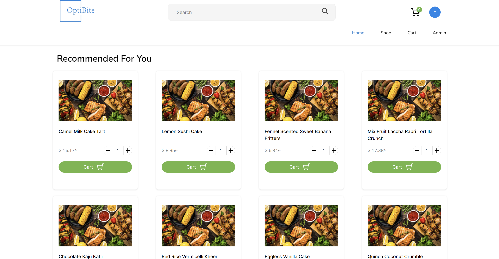
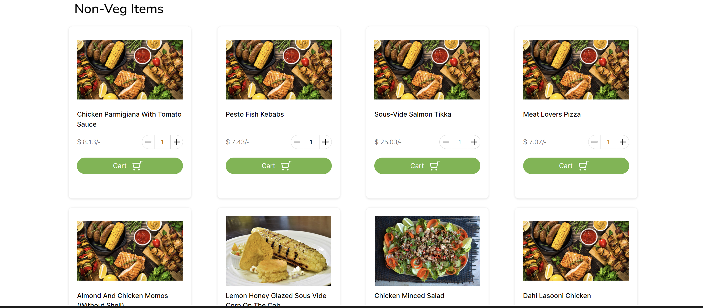
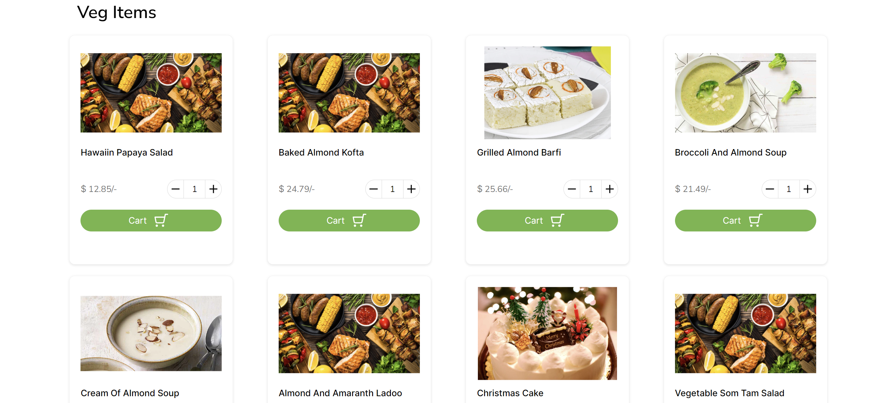
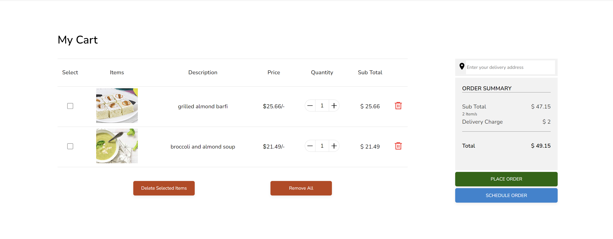
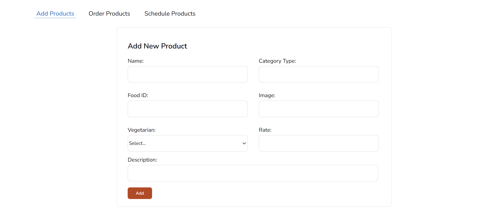
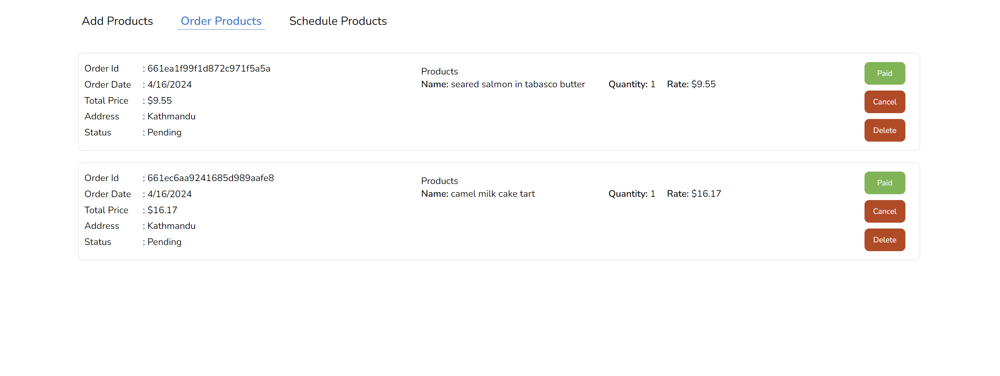
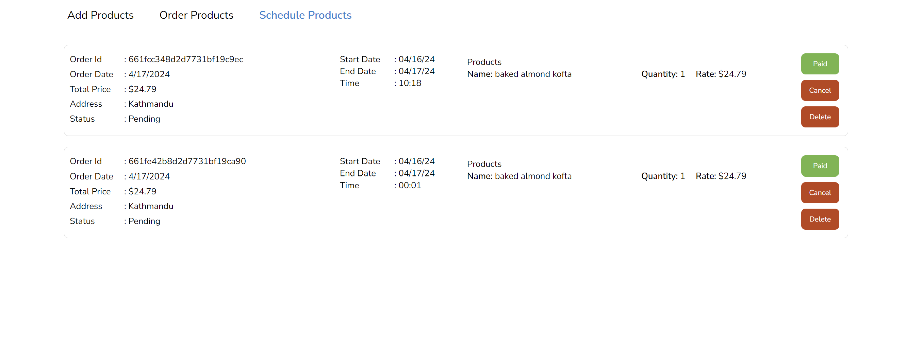
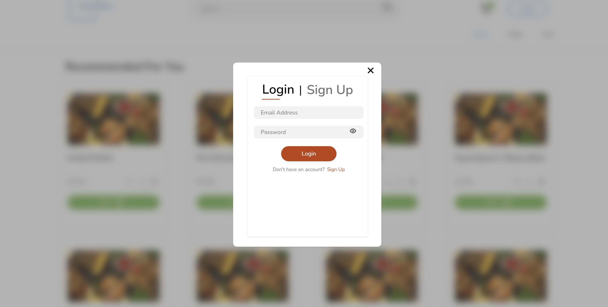
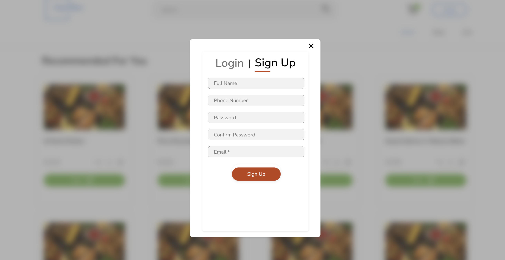

# Optibyte

A food ordering application built using MERN stack and Python. The system uses React for frontend, Node for Backend, MongoDB as database and Python for generating recommendations. The application relies on collaborative filtering for suggesting foods to users based on their previous food orders and preferencesof matched users. Below are the screenshots of application:

## Screenshots

